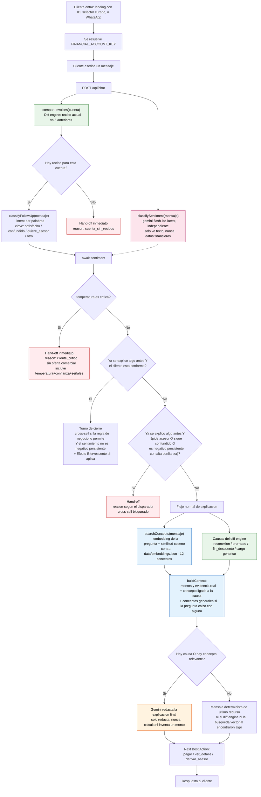

# Flujo del bot — diagrama as-built

Diagrama completo de cómo procesa el bot un mensaje, tal como quedó implementado en `app/api/chat/route.ts` (no el plan original — ver [FLUJO-INFORMACION.md](./FLUJO-INFORMACION.md) para esa versión). Dos diferencias grandes respecto al plan: existe un **Gate de sentimiento** que puede saltar por encima de cualquier otra regla, y la **capa vectorial** ya está activa (no es un fallback pendiente).

## Diagrama completo

**Colores:** rosa = clasificador de sentimiento (independiente, corre en paralelo). Verde = capa determinista (diff engine, nunca "genera" un número, solo lee y compara). Azul = capa vectorial (elige qué explicación general mostrar, nunca decide montos). Naranja = donde entra el LLM a redactar. Rojo = las 3 salidas de hand-off.

## Por qué el Gate de sentimiento va primero

La regla de negocio original solo consideraba palabras clave ("no entiendo", "quiero un asesor"). El Gate de sentimiento se agregó **por encima** de esa lógica porque un cliente puede estar molesto sin usar ninguna de esas palabras — "otra vez me cobran de más y nadie me explica nada" no dispara ningún keyword, pero sí es negativo con alta confianza. Por eso el chequeo de `temperatura == critica` ocurre antes que cualquier otra rama, incluida la del turno de cierre.

## Por qué la búsqueda vectorial corre siempre, no solo cuando falla el diff engine

Un cliente puede preguntar algo genérico ("¿qué es Movistar Total?") en una cuenta que además tiene una causa de variación detectada. Si la búsqueda vectorial solo corriera cuando `hasCauses` es falso, esa pregunta real se quedaría sin responder — el bot le explicaría su reconexión en vez de responder lo que preguntó. Por eso `searchConcepts()` corre en paralelo a leer las causas, y ambas cosas se le pasan juntas a Gemini para que redacte lo que efectivamente corresponde a la pregunta.

## Las 3 capas de retrieval, resumidas

| | Determinista (verde) | Vectorial (azul) | Sentimiento (rosa) |
|---|---|---|---|
| **Qué decide** | Montos, fechas, causa exacta | Qué explicación general mostrar | Prioridad del Gate, no el contenido de la respuesta |
| **Puede alucinar un monto** | No — lectura directa de filas del CSV | No — nunca toca montos | No aplica, no genera texto de negocio |
| **Fuente** | `FACTURACION-CLIENTES.csv` + tablas de escenario | `concepts/*.md` (12 archivos) vía `data/embeddings.json` | Solo el texto del mensaje del cliente |
| **Módulo** | `lib/diff-engine.ts` | `lib/concept-retrieval.ts` | `lib/sentiment.ts` |
