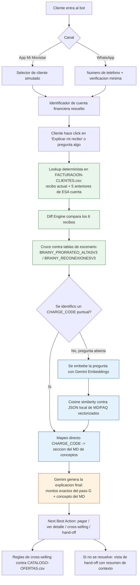

# Flujo de información

> Este documento describe el flujo tal como se planificó. Para el diagrama completo **as-built** (incluye el gate de sentimiento, que no estaba planeado originalmente, y la capa vectorial ya activa en vez de pendiente) ver [FLUJO-BOT-MERMAID.md](./FLUJO-BOT-MERMAID.md).

Cómo se mueve la data desde que el cliente abre el bot hasta que recibe una respuesta. Idea central: **el CSV es lo específico del cliente (montos, fechas, cargos reales), el MD es lo genérico (qué significa cada concepto, igual para todos los clientes).** Nunca se cruzan directamente — el resultado del CSV decide qué parte del MD se usa.

## Diagrama end-to-end

En verde: la capa **determinista** (nunca se equivoca en un monto porque nunca "genera" nada, solo lee y compara). En azul: la capa **vectorial** (solo decide qué explicación mostrar, nunca un número). En naranja: donde entra el LLM, y solo para redactar.

## Las dos capas de retrieval, explicadas

| | Capa determinista | Capa vectorial |
|---|---|---|
| **Qué recupera** | Montos, fechas, códigos de cargo reales del cliente | Explicaciones generales de conceptos, FAQ |
| **Cómo** | Filtro exacto por `FINANCIAL_ACCOUNT_KEY` + `CHARGE_CODE` | Embeddings (Gemini) + similitud coseno |
| **Fuente** | `FACTURACION-CLIENTES.csv`, `BRAINY_PRORRATEO_ALTASV3.csv`, `BRAINY_RECONEXIONESV3.csv` | MD curados a mano desde los PDF/PPTX de Academia Movistar |
| **Es específico del cliente?** | Sí, 100% | No, es igual para todos los clientes |
| **Puede alucinar?** | No — es lectura directa de filas | No en los montos (no los toca); sí podría "elegir mal" el fragmento, por eso se prefiere el mapeo directo cuando existe |
| **Dónde vive** | Archivos CSV empaquetados en el deploy | JSON de embeddings empaquetado en el deploy |

## Por qué todo local (sin base de datos en la nube)

- El deploy en Vercel ya resuelve "accesible desde cualquier lado, no depende de mi laptop" — eso lo da el hosting, no dónde vive la data.
- Con datos de este tamaño (miles de filas, no millones) y retrieval exacto por llave, una base de datos externa no aporta nada que no tengamos ya, y sí suma: latencia, manejo de credenciales (justo lo que Zero Trust pide hacer bien, no rápido) y un punto de falla nuevo en pleno pitch.
- Google Drive es válido **solo** como espacio de trabajo del equipo mientras curan los MD — antes del pitch esos archivos se copian al repo y ahí se calculan los embeddings una sola vez.

## Ejemplo concreto paso a paso (escenario reconexión)

1. Cliente entra por WhatsApp, escribe su número → se identifica su `FINANCIAL_ACCOUNT_KEY`.
2. Pregunta: "¿por qué me llegó más caro?"
3. Backend trae su recibo actual + 5 anteriores de `FACTURACION-CLIENTES.csv`.
4. Diff engine ve un cargo nuevo con `CHARGE_CODE_ID = OC1_RECONEXION`, monto exacto S/.X, y lo cruza con `BRAINY_RECONEXIONESV3.csv` para confirmar fecha de corte y de reconexión.
5. Como el `CHARGE_CODE` ya identifica el concepto exacto, se va directo (sin buscar por similitud) a la sección "Reconexión" del MD de conceptos.
6. Gemini arma: *"Tu recibo subió S/.X porque el [fecha] se te reconectó el servicio tras una suspensión por pago pendiente. Este cargo cubre el proceso de reactivación."*
7. Next Best Action: pagar / ver detalle / (si aplica la Regla 2 de cross-selling y la consulta quedó resuelta) ofrecer un bono de datos.
8. Si el cliente insiste en que no entiende → hand-off con resumen (motivo: "reconexión", monto: S/.X, ya se explicó: sí) a un asesor simulado.
